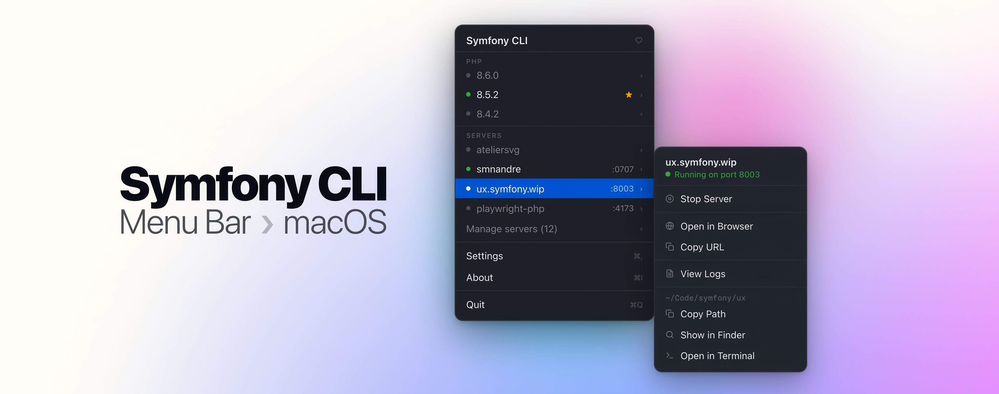

# Symfony CLI Menu Bar

> A native macOS menu bar app for managing local [Symfony CLI](https://github.com/symfony-cli/symfony-cli) servers.



Access, start, and stop your local Symfony servers from the menu bar. Open them in your browser, view logs, manage PHP versions and proxy domains — without leaving your current context.

## Features

- **Server management**: view all your Symfony local servers at a glance; start and stop them directly from the menu
- **One-click browser open**: open any running server in your default browser instantly
- **Server logs**: jump straight to `symfony server:log` in Terminal, pre-filled for the right project
- **PHP versions**: see all installed PHP versions and set the default
- **Proxy domains**: manage `.wip` Symfony proxy domains
- **Auto-updates**: built-in update notifications powered by Sparkle
- **Start at Login**: optionally launch on login so it is always available

## Requirements

- macOS 14.0 or later
- [Symfony CLI](https://symfony.com/download) installed and available in your `PATH`

## Installation

### Download (recommended)

Download the latest `.dmg` from the [Releases page](https://github.com/smnandre/symfony-cli-menubar/releases), open it,
and drag **Symfony CLI Menu Bar** to your Applications folder.

### Build from Source

```bash
git clone https://github.com/smnandre/symfony-cli-menubar.git
cd symfony-cli-menubar

# Build and package
swift build -c release
./scripts/package.sh release

# Run
open SymfonyCLIMenuBar.app
```

## Contributing

Contributions are welcome. Please open an issue before submitting a pull request for significant changes.
See [CONTRIBUTING.md](.github/CONTRIBUTING.md) for development guidelines.

## Thanks

Symfony CLI Menu Bar builds on top of remarkable open source work.

**[Symfony](https://symfony.com)**: the PHP framework this whole ecosystem is built on.
Fabien Potencier [@fabpot](https://github.com/fabpot) and the Symfony contributors.

**[Symfony CLI](https://github.com/symfony-cli/symfony-cli)**: the local server tooling this app brings to your menu
bar.
Fabien Potencier [@fabpot](https://github.com/fabpot) and Tugdual Saunier [@tucksaun](https://github.com/tucksaun).

## License

Released by [Simon André](https://smnandre.dev) under the [MIT License](LICENSE).

"Symfony" and the Symfony logo are registered trademarks of [Symfony SAS](https://symfony.com). The Symfony name and
logo are used in this project with the kind permission of the Symfony team. This project is not affiliated with or
endorsed by Symfony SAS or SensioLabs. See [NOTICE](NOTICE) for full trademark notices.
