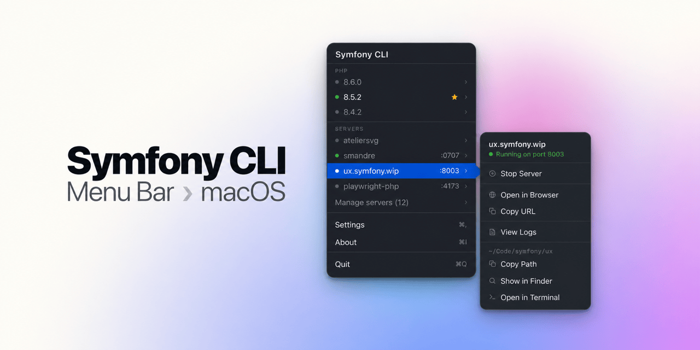

# Symfony CLI Menu Bar



Manage [Symfony CLI](https://github.com/symfony-cli/symfony-cli) servers, PHP versions, and proxy domains from the macOS menu bar.

## Install

### Homebrew

Install Symfony CLI first if needed:

```bash
brew install symfony-cli/tap/symfony-cli
```

Then install the app:

```bash
brew trust --cask smnandre/tap/symfony-cli-menubar
brew install --cask smnandre/tap/symfony-cli-menubar
```

After installation, the short cask name is enough:

```bash
brew upgrade --cask symfony-cli-menubar
brew uninstall --cask symfony-cli-menubar
```

### Direct download

Download the DMG from the [latest release](https://github.com/smnandre/symfony-cli-menubar/releases/latest), open it, then drag `SymfonyCLIMenuBar.app` to `Applications`.

## Usage

- View local Symfony servers
- Start and stop servers
- Open running servers in your browser
- View server logs in Terminal
- Choose the default PHP version
- Manage Symfony proxy domains
- Check for updates through the published Homebrew cask
- Launch the app when you sign in

## Requirements

- macOS 26 or later
- Apple silicon
- [Symfony CLI](https://symfony.com/download) available in your `PATH`

## Build from source

```bash
git clone https://github.com/smnandre/symfony-cli-menubar.git
cd symfony-cli-menubar

make verify
make run
```

## Contributing

Contributions are welcome. Run `make verify` before opening a pull request. See [CONTRIBUTING.md](.github/CONTRIBUTING.md) for development guidelines.

## Thanks

Thanks to the Symfony and Symfony CLI projects and their contributors.

**[Symfony](https://symfony.com)**: the PHP framework.
Fabien Potencier [@fabpot](https://github.com/fabpot) and the Symfony contributors.

**[Symfony CLI](https://github.com/symfony-cli/symfony-cli)**: the local server tooling this app brings to the menu bar.
Fabien Potencier [@fabpot](https://github.com/fabpot) and Tugdual Saunier [@tucksaun](https://github.com/tucksaun).

## License

Symfony CLI Menu Bar is released by [Simon André](https://smnandre.dev) under the [MIT License](LICENSE).

"Symfony" and the Symfony logo are registered trademarks of [Symfony SAS](https://symfony.com). The Symfony name and logo are used in this project with the kind permission of the Symfony team. This project is not affiliated with or endorsed by Symfony SAS or SensioLabs. See [NOTICE](NOTICE) for full trademark notices.
